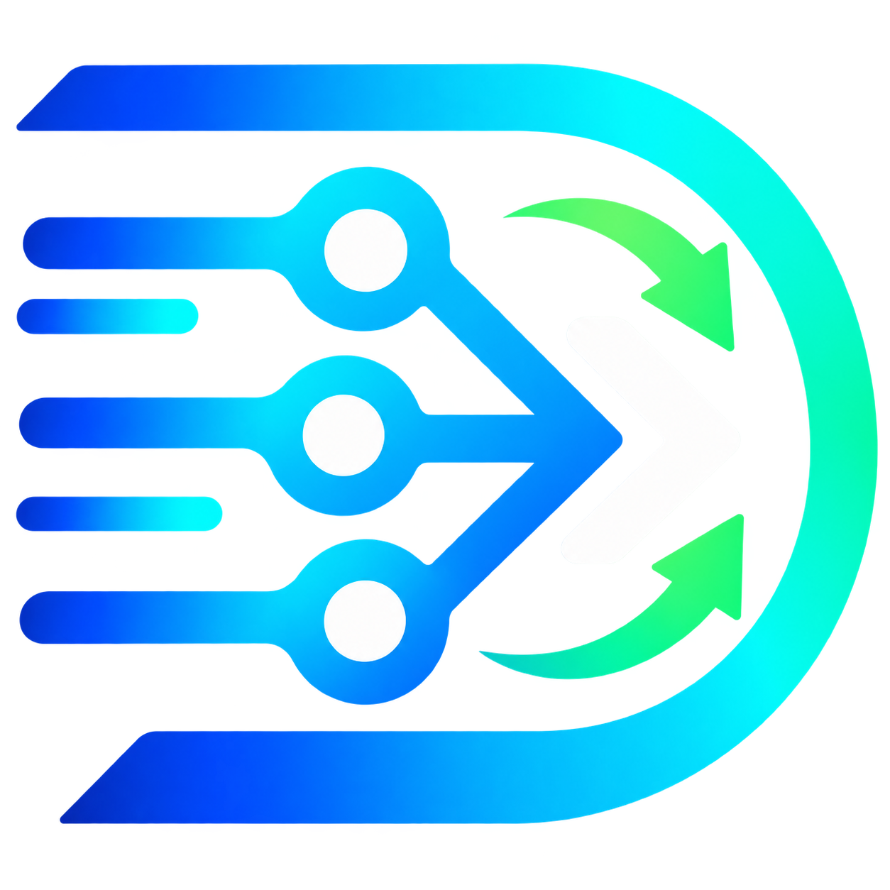

<p align="center">
  
</p>

<h1 align="center">DevBoost</h1>

<p align="center">A small macOS dashboard and CLI for remote development servers.</p>

## Features

- See local SSH port forwards and discover services listening on remote hosts.
- Run forwards for one session or keep them alive automatically with `launchd`.
- Sync folders over SSH with safe two-way merging or one-way mirroring.
- Monitor remote Docker containers and open live container logs.
- Track usage and balances for supported AI provider accounts.
- Use the browser dashboard or the lightweight command-line interface.

## How to run

Requirements: macOS, Python 3, SSH access to at least one development server, and
`rsync` for folder sync.

From a checkout:

```bash
./run-app.sh
```

This builds and launches the menu-bar app and dashboard at
<http://localhost:3080>. Use `./run-app.sh --foreground` to keep app output in
the terminal. Configure servers in the dashboard, or set the initial server in
the per-user `.env` file before the first launch. Runtime state is kept outside
the repository.

## Using DevBoost

The dashboard shows active forwards, remote services, Docker data, folder syncs,
and usage accounts. Common CLI commands are:

```bash
devboost                 # list forwards
devboost add 8080        # forward remote port 8080 for this session
devboost add 3030 --always "Grafana"
devboost scan            # find listening remote services
devboost sync            # list folder syncs
devboost docker          # show remote containers
devboost usage --refresh # refresh provider usage
devboost clean           # clean orphaned SSH forwards
devboost ui              # open the dashboard
```

Forwards and syncs can be changed between temporary (`Once`) and persistent
(`Auto`) operation. Two-way sync is always a safe merge: newer files win and
deletions never propagate. `mirror --delete` is available only for one-way sync.

## Development

DevBoost is a standard-library-only Python project. The main compatibility entry
point is [`devboost.py`](devboost.py); the dashboard assets live in `dashboard/`.

Run checks before contributing:

```bash
python3 -W error::SyntaxWarning -m py_compile devboost.py
python3 -m unittest discover tests -v
```

Please open an issue or pull request with improvements, bug reports, tests, or
ideas. Contributions are welcome.
